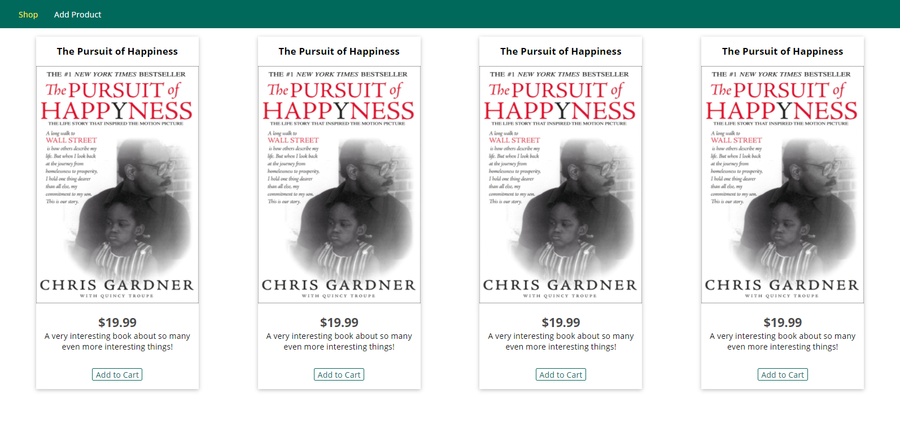

# Project: Building an Ecommerce App with NodeJs

In this project, I Will be creating an ecommerce site using NodeJs

 

## Built With

- NodeJs
- MongoDB
- CSS3

## Live link
coming soon...

## Getting Started

Open your terminal or text editor and use next command

        git clone https://github.com/emmanuelkamala/my-node-app.git

        cd my-node-app

        Run 'npm install' command to install package dependencies

## Run the app

npm start

visit: http://localhost:3000

## Author

👤 **Author1**

- Github: [emmanuelkamala](https://github.com/emmanuelkamala)
- Twitter: [ejkamala](https://twitter.com/ejkamala)
- Linkedin: [emmanuelkamala](https://linkedin.com/in/emmanuelkamala)

## 🤝 Contributing

Contributions, issues and feature requests are welcome!

Feel free to check the [issues page](issues/).

## Show your support

Give a ⭐️ if you like this project!
